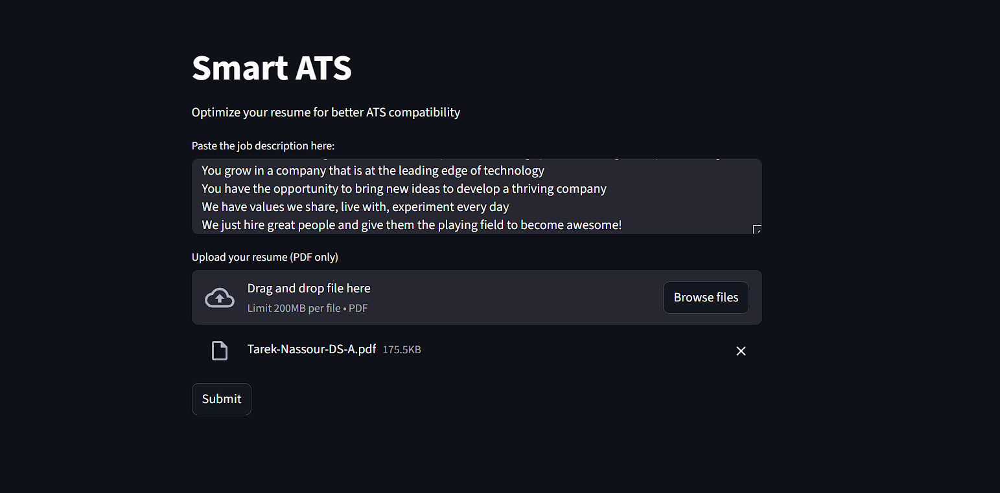
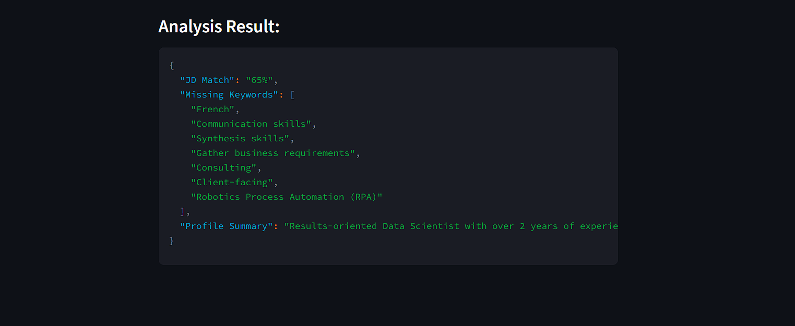

# Smart ATS – AI Resume Analyzer

Smart ATS is a lightweight web application that simulates an Applicant Tracking System (ATS).
It uses Google Gemini (Generative AI) to evaluate how well a resume matches a job description
and provides clear feedback to improve ATS compatibility.

---

## What It Does

- Analyzes a resume against a job description
- Calculates ATS match percentage
- Identifies missing important keywords
- Generates profile improvement suggestions
- Designed for job seekers and career optimization

---

## Tech Stack

- Python 3.10
- Streamlit
- Google Gemini (Generative AI)
- PyPDF2
- Docker

---

## Streamlit UI

### Home Page

### Results

## How to Run (Docker)

docker build -t smart-ats .
docker run -p 8501:8501 --env-file .env smart-ats

## Environment Variable

GOOGLE_API_KEY=your_api_key_here

## Key Highlights

- Containerized a real AI application using Docker
- Integrated Generative AI (Gemini) into a production-style app
- Clean and simple Streamlit UI
- CI/CD-ready project structure

## Author

Tarek Nassour – Data Science & AI Enthusiast
